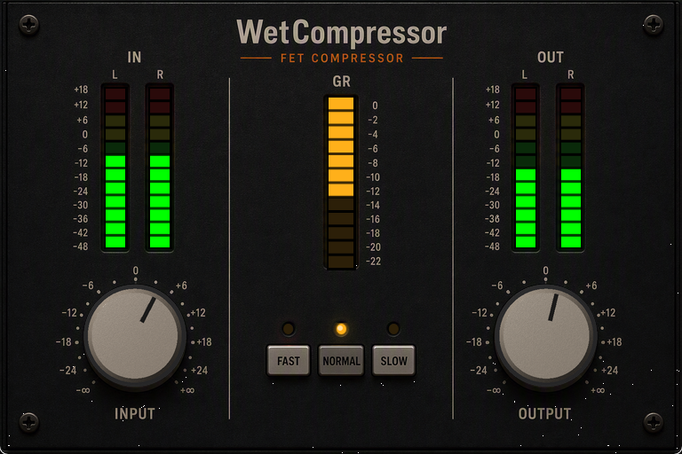
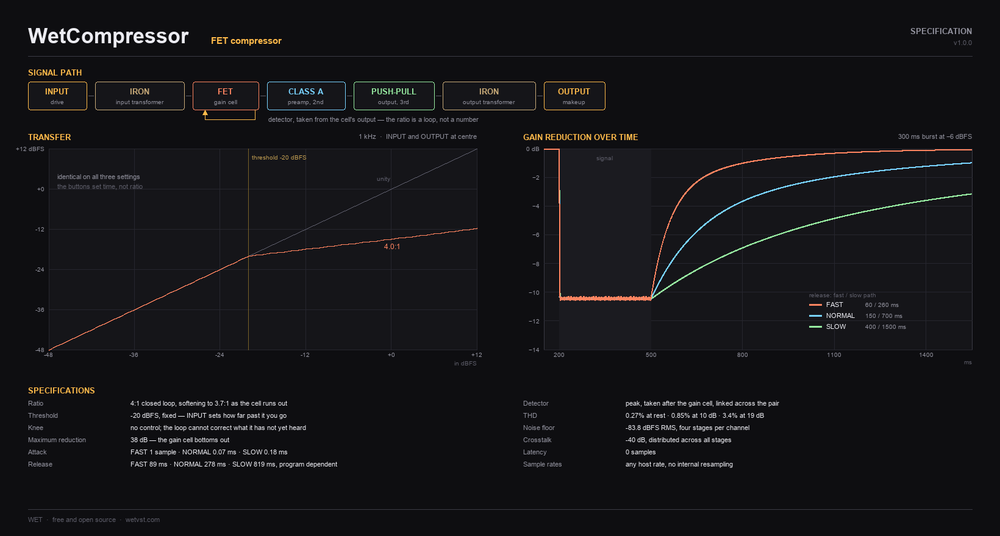

# WET Compressor VST3 Plugin


A 76-style FET compressor VST3 plugin, modelled as the circuit rather than as a gain computer, with the feedback detector, transformers and gain-cell distortion of a 1960s rack limiter.



> **Panel too big or too small?** Right-click anywhere on the panel and pick **UI Zoom** - 75%, 100% or 125%.

## Features

- **Two Controls**: INPUT drives the signal past a fixed threshold, OUTPUT puts back what that cost
- **Three Timings**: FAST, NORMAL and SLOW select attack and release together
- **Stepped Knobs**: 21 detents each, 3 dB apart, 0 dB at the centre - hold Shift for 1 dB
- **Full Metering**: Stereo input and output peak meters plus a gain-reduction strip
- **VST3 Automation**: Full parameter automation support in DAWs
- **Resizable UI**: Right-click the panel for UI Zoom - 75%, 100% or 125%

### FET Rack-Style Character

- **Feedback Detector**: Taken from the output of the gain cell, so the 4:1 is a closed-loop ratio that softens on its own near the threshold - no knee control needed
- **One Sample of Loop Delay**: The detector cannot see a sample until it has been through the cell, so the leading edge of a transient gets through
- **Gain Cell That Bottoms Out**: A hard floor at 38 dB of reduction; past that, driving harder buys distortion rather than compression
- **Distortion That Tracks Compression**: 0.02% at rest, 2.9% at 19 dB of reduction, because the device setting the gain is the device making the harmonics
- **Four Amplifiers**: Input transformer, gain cell, single-ended class-A preamp (2nd harmonic), push-pull class-A output into the output iron (3rd)
- **Two-Constant Release**: Fast and slow paths in parallel, the slow one weighted by how deep the reduction went
- **Per-Stage Noise and Crosstalk**: Every stage adds its own noise and leaks into the channel beside it; -40 dB total, -93.7 dBFS floor
- **Component Tolerance**: 2.5% per channel, so the two sides are never quite the same channel twice

## Download & Installation

### Windows

1. **Download** the latest release from [GitHub Releases](https://github.com/yonie/WetCompressor/releases)
2. **Extract** the ZIP file
3. **Copy** `WetCompressor.vst3` to your VST3 folder:
   - User: `C:\Users\[Username]\Documents\VST3\`
   - System: `C:\Program Files\Common Files\VST3\`
4. **Restart your DAW** and rescan plugins

### Linux

1. **Download** the latest release from [GitHub Releases](https://github.com/yonie/WetCompressor/releases)
2. **Extract** the ZIP file
3. **Copy** `WetCompressor.vst3` to your VST3 folder:
   - User: `~/.vst3/`
   - System: `/usr/lib/vst3/`
4. **Restart your DAW** and rescan plugins

### macOS

1. **Download** the latest release from [GitHub Releases](https://github.com/yonie/WetCompressor/releases)
2. **Extract** the ZIP file
3. **Copy** `WetCompressor.vst3` to your VST3 folder:
   ```
   ~/Library/Audio/Plug-Ins/VST3/
   ```
4. **Remove quarantine attribute** (see below)
5. **Restart your DAW** and rescan plugins

Note that by default, the Library folder may not be shown in the Finder. See the macOS documentation on how to make it visible.

#### ❗️ macOS Security Notice

macOS may block the plugin because it's unsigned. This **does not mean** the plugin is unsafe.

**Remove quarantine attribute:**

```bash
xattr -rd com.apple.quarantine ~/Library/Audio/Plug-Ins/VST3/WetCompressor.vst3
```

**What this command does:**
- `xattr` = extended attribute tool
- `-r` = recursive (process all files in the bundle)
- `-d` = delete the specified attribute
- `com.apple.quarantine` = the quarantine attribute

Restart your DAW after running the command.

#### Why macOS Blocks This Plugin

When you try to load the plugin in your DAW, you may see an error:

> "WetCompressor.vst3" cannot be opened because the developer cannot be verified.

This **does not mean** the plugin contains malware or is unsafe.

This is due to **Apple's security policy**, which requires developers to:
- Enroll in the Apple Developer Program
- Pay **$99/year** for a developer certificate
- Notarize each build with Apple

As an independent developer releasing **free, open-source software** under the MIT license, I currently don't have the budget for Apple's developer program. The complete source code is available on GitHub for anyone to inspect and build themselves.

This is a common issue with free audio plugins on macOS. You'll encounter the same message with many free, open-source VSTs.


## Usage

1. **Load the plugin** in your DAW (Reaper, Cubase, Ableton Live, FL Studio, etc.)
2. **Turn up INPUT** until the gain-reduction meter shows the amount you want - this is the compression control, there is no threshold knob
3. **Pick a timing** with FAST, NORMAL or SLOW
4. **Bring OUTPUT up** to make up what the compression took
5. **Automate** any of the three for creative effects

### Parameter Reference

| Parameter | Range | Default | Description |
|-----------|-------|---------|-------------|
| Input | 21 detents of 3 dB, +/-30 dB (1 dB with Shift) | 0 dB, centre detent | Drive into the gain cell. More input is more compression |
| Output | 21 detents of 3 dB, +/-30 dB (1 dB with Shift) | 0 dB, centre detent | Makeup gain after the output stage |
| Mode | 0-2 | 1 (NORMAL) | 0=FAST, 1=NORMAL, 2=SLOW |

### Timings

| Setting | Attack | Release |
|---------|--------|---------|
| FAST | 1 sample | 89 ms |
| NORMAL | 0.07 ms | 278 ms |
| SLOW | 0.18 ms | 819 ms |

All three attack settings are under a millisecond, as on the original hardware -
its whole attack range is 20 to 800 microseconds. SLOW here is still faster than
most compressors at their fastest.

### Mouse

- **Wheel**: one detent per notch, or 1 dB with Shift held
- **Shift-drag**: fine adjust, three steps inside every detent
- **Ctrl-click** or **double-click**: back to 0 dB
- **Right-click the panel**: UI Zoom - 75%, 100% or 125%



## Building from Source

If you want to build the plugin yourself, follow these instructions.

### System Requirements

#### Windows
- **Operating System**: Windows 10/11 (64-bit)
- **Build Tools**: 
  - Visual Studio 2022 Build Tools or Community Edition
  - CMake 3.15 or higher
  - Git

#### Linux
- **Operating System**: Linux (x86_64)
- **Build Tools**:
  - GCC or Clang with C++17 support
  - CMake 3.15 or higher
  - Git
- **Dependencies** (Ubuntu/Debian):
  ```
  sudo apt-get install cmake gcc g++ libstdc++6 libx11-xcb-dev libxcb-util-dev \
      libxcb-cursor-dev libxcb-xkb-dev libxkbcommon-dev libxkbcommon-x11-dev \
      libfontconfig1-dev libcairo2-dev libgtkmm-3.0-dev libsqlite3-dev \
      libxcb-keysyms1-dev git
  ```

#### macOS
- **Operating System**: macOS 10.13 or higher (Intel) / macOS 11.0 or higher (Apple Silicon)
- **Build Tools**:
  - Xcode Command Line Tools or Xcode
  - CMake 3.15 or higher
  - Git

### Step 1: Clone VST3 SDK

If the `vst3sdk` folder is not present, clone it:

```batch
git clone --recursive https://github.com/steinbergmedia/vst3sdk.git
```

### Step 2: Build

#### Windows
Run the automated build script:

```batch
build.bat
```

This will:
- Configure CMake for Visual Studio 2022
- Build the plugin in Release mode
- Run the VST3 validator (47 automated tests)
- Output: `WetCompressor\build\VST3\Release\WetCompressor.vst3`

#### Linux
Run the automated build script:

```bash
chmod +x build.sh
./build.sh
```

This will:
- Configure CMake with GCC/Clang
- Build the plugin in Release mode
- Run the VST3 validator (47 automated tests)
- Output: `WetCompressor/build/VST3/Release/WetCompressor.vst3`

#### macOS
Run the automated build script:

```bash
chmod +x build.sh
./build.sh
```

This will:
- Configure CMake with Clang
- Build the plugin in Release mode
- Run the VST3 validator (47 automated tests)
- Output: `WetCompressor/build/VST3/Release/WetCompressor.vst3`

### Step 3: Install

#### Windows
To install the plugin to your system's VST3 folder:

```batch
install.bat
```

**Note**: You may need to run as Administrator if you encounter permission errors.

#### Linux
To install the plugin to your user VST3 folder:

```bash
chmod +x install.sh
./install.sh
```

This installs to `~/.vst3/WetCompressor.vst3`

#### macOS
To install the plugin to your user VST3 folder:

```bash
chmod +x install.sh
./install.sh
```

This installs to `~/Library/Audio/Plug-Ins/VST3/WetCompressor.vst3`

---


## Technical Details

### Architecture

- **Framework**: VST3 SDK (Official Steinberg)
- **Language**: C++17
- **Build System**: CMake (MSBuild on Windows, Make on Linux)
- **GUI**: VSTGUI4

### Audio Processing

- **Host Sample Rates**: Supports 22.05 kHz to 384 kHz
- **Internal Sample Rate**: Host rate - nothing is resampled, quantised or band-limited
- **Host Bit Depth**: 32-bit float processing
- **Ratio**: 4:1 closed loop, softening to 3.7:1 as the cell runs out
- **Threshold**: -20 dBFS, fixed
- **Maximum Reduction**: 38 dB
- **Latency**: 0 samples
- **CPU Usage**: <0.5% (typical)

### Implementation Details

- **Gain Cell**: FET as a shunt voltage-controlled resistor, with a drain-to-gate divider cancelling most of the square-law term
- **Q-Bias**: A standing gate voltage, so the cell is never fully out of circuit
- **Detector**: Peak rectifier taken after the gain cell, linked across the stereo pair
- **Sidechain**: One attack constant, two release constants in parallel, slow path weighted by depth
- **Input Transformer**: Low-frequency flux saturation and high-frequency leakage loss, ahead of the INPUT control as on the hardware
- **Output Stage**: Push-pull class A into the output iron - symmetric, so third harmonic
- **Noise**: Four uncorrelated sources per channel plus a tilted component, -93.7 dBFS
- **Thread Safety**: Lock-free atomic operations for GUI communication

## Project Structure

```
WetCompressor/
|-- vst3sdk/                    # VST3 SDK (git submodule)
|-- WetCompressor/              # Plugin source
|   |-- source/
|   |   |-- wetcompprocessor.h/cpp     # Audio processing
|   |   |-- wetcompcontroller.h/cpp    # Parameter control
|   |   |-- compengine.h/cpp           # The compressor
|   |   |-- fetcore.h                  # Gain cell, sidechain, transformers, amps
|   |   |-- compknob.h/cpp             # Stepped filmstrip knob
|   |   |-- modeswitch.h/cpp           # FAST / NORMAL / SLOW cluster
|   |   |-- ledmeterview.h/cpp         # LED meters
|   |   |-- wetcompcids.h              # Plugin IDs
|   |   `-- version.h                  # Version info
|   |-- resource/
|   |   `-- wetcompeditor.uidesc       # GUI definition
|   |-- CMakeLists.txt                 # Build configuration
|   `-- build/                         # Build output (generated)
|-- tools/
|   `-- comptest.cpp            # DSP measurement harness, no host required
|-- docs/                       # Panel shot and specification sheet
|-- build.bat                   # Build automation script
|-- install.bat                 # Installation script
|-- LICENSE                     # MIT License
`-- README.md                   # This file
```

## Validation Results

The plugin passes all official VST3 validation tests:

**47 tests passed, 0 tests failed**

Key validations:
- Valid state transitions
- Proper bus configuration
- Correct parameter handling
- Sample rate support (22.05 kHz - 384 kHz)
- Thread safety
- Preset save/load
- Plugin suspend/resume

`tools/comptest.cpp` measures the DSP directly, with no plugin and no host: the
static transfer curve, gain reduction against time for each timing at sample
resolution, distortion against gain reduction split into second and third
harmonic, the noise floor and the channel crosstalk.

```
cl /EHsc /O2 /std:c++17 /I WetCompressor/source tools/comptest.cpp ^
   WetCompressor/source/compengine.cpp
```

## Troubleshooting

### macOS Issues

**Plugin not appearing in DAW:**
- You forgot to remove the quarantine attribute - see Installation section above
- Restart your DAW after running the `xattr` command
- Check VST3 scan path: `~/Library/Audio/Plug-Ins/VST3/`
- Verify the folder contains `WetCompressor.vst3`

**Still getting "cannot be verified" after running xattr:**
- Right-click the plugin → "Open" → "Open" to bypass Gatekeeper
- Check DAW console for error messages
- Report issue at [GitHub Issues](https://github.com/yonie/WetCompressor/issues)

**Plugin crashes DAW:**
- macOS 10.13+ (Intel) or macOS 11.0+ (Apple Silicon) required
- Check DAW console for error messages
- Report issue at [GitHub Issues](https://github.com/yonie/WetCompressor/issues)

### Runtime Issues

**No sound output:**
- Verify the plugin is receiving audio input
- Check that INPUT is not at the bottom of its travel
- Ensure your DAW is routing through the plugin correctly

**Nothing on the gain-reduction meter:**
- The threshold is fixed at -20 dBFS. Turn INPUT up until the signal reaches it
- Quiet material may need a lot of INPUT; that is the control working as intended

**Distorting more than expected:**
- The gain cell bottoms out at 38 dB. Past that, more INPUT buys distortion
  rather than compression - back INPUT off and make up with OUTPUT


## Author

**Ronald Klarenbeek**
- Website: [https://wetvst.com](https://wetvst.com)
- Email: contact@wetvst.com
- GitHub: [https://github.com/yonie](https://github.com/yonie)

## Trademarks

All product names, trademarks and registered trademarks are property of their
respective owners, and any reference to them here describes only the kind of
equipment this plugin was inspired by. No manufacturer has endorsed, sponsored
or licensed this plugin, and no third-party intellectual property is used in it.

## License

MIT License - Copyright © 2026 Ronald Klarenbeek (Yonie)

This project is licensed under the MIT License - see the [LICENSE](LICENSE) file for details.

**Note:** This project uses the VST3 SDK which is licensed under a BSD-style license.
See the VST3 SDK license files for details on SDK licensing.

## Acknowledgments

- Steinberg Media Technologies for the VST3 SDK
- VSTGUI framework for cross-platform GUI support
- The audio plugin development community


## Version History

### v1.0.0 (2026-08-30)
- Initial release
- FET compressor with a feedback detector and a fixed 4:1 closed-loop ratio
- Two stepped knobs, 21 detents each (61 positions with Shift), and three timings
- Stereo input and output metering plus a gain-reduction strip
- Full VST3 automation support
- Validated with official VST3 validator
- **Modelled as the circuit**:
  - Gain cell with drain-to-gate linearisation and a 38 dB floor
  - Distortion and noise that rise with gain reduction
  - Input and output transformers, class-A preamp, push-pull output stage
- **Per-Stage Noise and Crosstalk**:
  - -40 dB channel bleed distributed across all stages
  - 2.5% component tolerance per channel


---

**Built with ❤️ and precision engineering**

## Support

If you find this plugin helpful, consider buying me a coffee!

[](https://buymeacoffee.com/yonie)

---

Part of **[WET](https://wetvst.com)** - with [WetDelay](https://github.com/yonie/WetDelay), [WetReverb](https://github.com/yonie/WetReverb) and [WetEQ](https://github.com/yonie/WetEQ)
